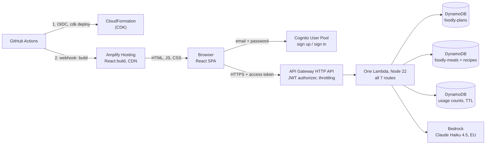

# Backend, infrastructure and CI/CD

[← Back to the README](../README.md)

## Architecture



- **One region,** `eu-west-2` (London). The Bedrock `eu.` inference profile keeps AI calls inside the EU.
- **The browser talks to Cognito directly** for sign-in, using our own forms. API Gateway checks the access token before the Lambda runs, and the Lambda takes the user id from the token, never from the request ([decision 5](decisions.md#5-authentication-cognito-with-our-own-email--password-forms)).
- **One Lambda for all routes** ("Lambdalith") with one data layer. Feature folders (`suggest/`, `understand/`, `recipe/`) only import `data/` ([decisions 18](decisions.md#18-a-small-backend-one-lambda-dynamodb-bedrock) and [25](decisions.md#25-backend-hardening-errors-config-in-infra-cached-meals-cost-limits)).
- **The Cognito User Pool was created in the console** and is referenced by id. Everything else is in CDK ([decision 24](decisions.md#24-backend-moved-from-the-console-to-cdk)).
- **The frontend is on Amplify Hosting** (CDN and HTTPS included). A rewrite rule sends page URLs to `index.html`, and the API's CORS list allows only the Amplify address and `localhost:5173` ([decision 27](decisions.md#27-frontend-hosting-amplify-hosting-built-only-after-ci)).

### API

All routes need a valid Cognito access token.

| Route                          | What it does                                                                      |
| ------------------------------ | --------------------------------------------------------------------------------- |
| `GET /meals`                   | The meal catalogue (~100 meals, without recipes), cached per Lambda instance      |
| `POST /meals/{id}/recipe`      | The saved recipe, or a new one from the AI, saved once for everyone               |
| `GET /plan?week=…`             | The user's plan for a week: `{ weekStart, slots: { "Monday Dinner": mealId } }`   |
| `PUT /plan`                    | Saves the slots (`UpdateItem`, so the stored answers are kept)                    |
| `PUT /plan/answers`            | Saves the user's answers on the plan, checked by the same code as the AI's output |
| `POST /plan/understand`        | Free text → structured answers (Bedrock). Daily limit per user                    |
| `GET /plan/suggestions?week=…` | 10 meal ids per meal type, scored from the saved answers                          |

## Backend (AWS)

Region `eu-west-2`. The CLI gets temporary credentials with `aws login` (no access keys stored), and CDK takes the profile from `AWS_PROFILE`:

```sh
export AWS_PROFILE=foodly
aws login --profile foodly

npx cdk diff FoodlyStack
npx cdk deploy FoodlyStack        # the app; CI does this on every merge to main
npx cdk deploy GithubDeployStack  # once, by hand: the role GitHub Actions uses
```

The app has two stacks, so always name the stack: `npx cdk deploy` alone fails, and `--all` would also redeploy the stack that holds CI's access.

**Prompt evaluation** (calls the real model, costs a few cents):

```sh
AWS_PROFILE=foodly AWS_REGION=eu-west-2 node server/lambda/understand/eval.mjs
MODEL_ID=<another model id> AWS_PROFILE=foodly AWS_REGION=eu-west-2 node server/lambda/understand/eval.mjs
```

## CI/CD

- **[`ci.yml`](../.github/workflows/ci.yml)** runs on every pull request: lint, Prettier check, type check and build, all tests, the axe tests again as a separate step, and `cdk synth` (bundles the Lambda without deploying). It has no AWS access.
- **Code review:** besides CI, every pull request gets an AI review from **CodeRabbit**. I treat its comments like a colleague's: some I fix, some I answer with a reason.
- **[`deploy.yml`](../.github/workflows/deploy.yml)** runs on every push to `main`: it runs `ci.yml` first, then `cdk deploy FoodlyStack` in the protected `production` environment, then starts the Amplify frontend build through a webhook. The `production` environment holds the variable `AWS_DEPLOY_ROLE_ARN` (output of `GithubDeployStack`) and the secret `AMPLIFY_WEBHOOK_URL`. Details in [decisions 26](decisions.md#26-cicd-github-actions-with-oidc-no-aws-keys-stored) and [27](decisions.md#27-frontend-hosting-amplify-hosting-built-only-after-ci).
- **Amplify** builds with [`amplify.yml`](../amplify.yml) (Node from `.nvmrc`, `npm ci`, `npm run build`). Its own auto-build is off, so the frontend never goes live before CI passes. The `VITE_` values and the rewrite rule are set in the Amplify console.

## Security and cost controls

- **No secrets in the repo or the browser.** The browser only holds Cognito's public ids. The Lambda reaches DynamoDB and Bedrock through its IAM role. CI signs in with OIDC, so no AWS keys exist anywhere. The only CI secret is the Amplify webhook URL (it can start builds), kept as a `production` environment secret.
- **Least privilege:** the Lambda gets only the DynamoDB actions it uses, per table, and `InvokeModel` on one model. The deploy role can only use CDK's bootstrap roles. GitHub tokens get only the permissions each job needs, and third-party actions in the deploy job are pinned to a commit.
- **Browser security headers** on every page ([`customHttp.yml`](../customHttp.yml)): a Content Security Policy that runs only our own scripts and lets the page call only our API and Cognito (so injected code couldn't send the tokens anywhere else), plus HSTS, `nosniff`, no framing, a strict `Referrer-Policy` and a `Permissions-Policy` that turns off camera, microphone, location and payment.
- **Input is validated in the Lambda** (week format, slot names, meal ids, text length), and the AI's output is validated like user input.
- **Auth:** "prevent user existence errors" is on in Cognito, so sign-in errors don't reveal which emails have accounts. Sign out revokes the refresh token, and redirects after sign-in are checked against open-redirect tricks ([`safe-redirect.ts`](../src/lib/safe-redirect.ts)). Tokens are in `localStorage`; the trade-off is explained in [decision 5](decisions.md#5-authentication-cognito-with-our-own-email--password-forms).
- **Cost:** API throttling, a per-user daily AI limit, recipes generated once per meal and shared, Haiku (the cheapest Claude model), and an AWS Budget alert.
